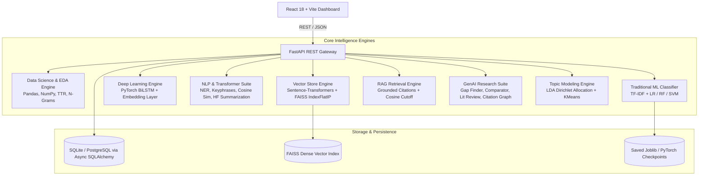

# ResearchMind — AI-Powered Research Intelligence & RAG Platform

[](https://python.org)
[](https://fastapi.tiangolo.com)
[](https://pytorch.org)
[](https://reactjs.org)
[](https://github.com/facebookresearch/faiss)
[](https://docs.pytest.org)
[](https://opensource.org/licenses/MIT)

**ResearchMind** is an end-to-end production AI research intelligence platform designed to showcase genuine Data Science, Machine Learning, Deep Learning (PyTorch), NLP, Vector Embeddings (FAISS), Retrieval-Augmented Generation (RAG), and Generative AI within a responsive full-stack architecture.

---

## 🏗 Full-Stack Architecture



---

## 🌟 Key Platform Features

### 1. Document Ingestion & Parsing
- Multi-format ingestion: **PDF**, **DOCX**, **TXT**, and **CSV**.
- Page-level segmentation, character & token counting, text cleaning, and stopword filtering.
- Asynchronous database storage via SQLAlchemy + SQLite/PostgreSQL.

### 2. Data Science & Exploratory Data Analysis (EDA)
- **Corpus-level profiling**: Total documents, unique vocabulary size, average words per document.
- **Lexical richness**: Type-Token Ratio (TTR), average word/sentence lengths, stopword proportion.
- **N-Gram Frequency Analyzer**: Unigrams, bigrams, and trigrams frequency extraction.
- **Tabular CSV EDA**: Shape, missing value detection, summary statistics.

### 3. Classical Machine Learning Pipeline
- TF-IDF feature extraction with configurable n-gram ranges and sublinear TF scaling.
- Cross-validated multi-class classifiers: **Logistic Regression**, **Random Forest**, and **Support Vector Machines (SVM)**.
- Metrics: Precision, Recall, F1-Score, Confusion Matrix, and persistent model serialization with Joblib.

### 4. Deep Learning NLP with PyTorch
- Custom **Bidirectional LSTM (BiLSTM)** neural network with trainable embedding layers.
- Full PyTorch training loop with cross-entropy loss, AdamW optimizer, validation step, and checkpointing.
- **ML vs Deep Learning Head-to-Head Benchmarking**: Throughput, training time, and accuracy evaluation.

### 5. NLP Intelligence & Transformers
- **Scientific Named Entity Recognition (NER)**: Identifies methods, models, metrics, and institutions.
- **Keyphrase Ranking**: Term importance scoring and TF-IDF keyphrase extraction.
- **Pairwise Cosine Similarity**: Sentence-level dense vector semantic distance.
- **Abstractive Summarization**: Hugging Face Transformer pipeline with length control.

### 6. Embeddings & FAISS Vector Database
- Dense vector representations via `all-MiniLM-L6-v2` (384 dimensions).
- In-memory & persisted **FAISS `IndexFlatIP`** (Inner Product on $L_2$-normalized vectors = Cosine Similarity).
- High-performance numpy fallback search for resource-constrained environments.

### 7. Grounded RAG Retrieval Engine
- Anti-hallucination cosine similarity cutoff threshold (customizable 0.0 - 0.8).
- Verifiable page-level citations attached to all generated research answers.
- Provider abstraction supporting **OpenAI**, **Gemini**, **Ollama (local)**, and **Deterministic Mock Provider**.

### 8. Flagship GenAI Research Suite
- 🔍 **Research Gap Finder**: Dual-angle vector retrieval (topic query + future work/limitations query) and LLM synthesis to extract unresolved research problems.
- 📄 **Multi-Document Comparator**: Side-by-side dimension comparison (Methodology, Datasets, Results, Limitations, Novelty) + overall synthesis.
- 📚 **Literature Review Generator**: Multi-section academic literature review with abstract, subsections, and cited sources.
- 🕸️ **Citation & Similarity Network**: Pairwise cosine similarity graph with shared concept extraction and hub document centrality.

### 9. Document Clustering & Topic Modeling
- **Latent Dirichlet Allocation (LDA)**: Probabilistic topic discovery over word-topic distributions with perplexity scoring.
- **KMeans Document Partitioning**: $L_2$-normalized TF-IDF vector clustering with inertia metrics and automatic cluster labeling.

---

## 📋 Complete Implementation Checklist

- [x] **Phase 1**: Project Architecture & Repository Setup
- [x] **Phase 2**: Document Ingestion & Multi-Format Parsing (PDF, DOCX, TXT, CSV)
- [x] **Phase 3**: Data Science Analysis & Automated EDA Engine
- [x] **Phase 4**: Traditional ML Classification Pipeline & Evaluation (LR, RF, SVM)
- [x] **Phase 5**: PyTorch Deep Learning NLP Pipeline (BiLSTM Classifier)
- [x] **Phase 6**: NLP Analytics, Entity Recognition & Transformers
- [x] **Phase 7**: Embeddings Pipeline & FAISS Vector Database Integration
- [x] **Phase 8**: RAG Retrieval Engine & Grounded Citation Generator
- [x] **Phase 9**: Generative AI Features (Gap Finder, Comparator, Literature Review)
- [x] **Phase 10**: Document Clustering & Topic Modeling (LDA + KMeans)
- [x] **Phase 11**: FastAPI Production REST APIs Integration & OpenAPI Docs
- [x] **Phase 12**: React Frontend Dashboard & Interactive Studio
- [x] **Phase 13**: Dockerization & Multi-Container Docker Compose
- [x] **Phase 14**: End-to-End Automated Testing & Quality Assurance (41/41 Tests)
- [x] **Phase 15**: Production Deployment Preparation & Documentation

---

## ⚡ Getting Started

### Option A: Local Development

#### 1. Backend Setup
```bash
cd backend
python -m venv .venv
source .venv/bin/activate  # On Windows: .venv\Scripts\activate
pip install -r requirements.txt
python -m nltk.downloader punkt stopwords wordnet
uvicorn app.main:app --reload --port 8000
```
- Interactive API Docs: `http://localhost:8000/docs`
- Health Check: `http://localhost:8000/api/v1/health/detailed`

#### 2. Frontend Setup
```bash
cd frontend
npm install
npm run dev
```
- Web Application Dashboard: `http://localhost:3000`

---

### Option B: Docker Compose

```bash
docker-compose up --build
```
- Frontend: `http://localhost:3000`
- Backend API: `http://localhost:8000`
- API Docs: `http://localhost:8000/docs`

---

## 🧪 Automated Testing

Run the full automated test suite covering all 10 intelligence pipelines:
```bash
cd backend
pytest tests/ -v
```

```
====================== 41 passed, 29 warnings in 19.34s =======================
```

---

## 📜 License
MIT License. Built for advanced AI/ML research intelligence demonstrations.
